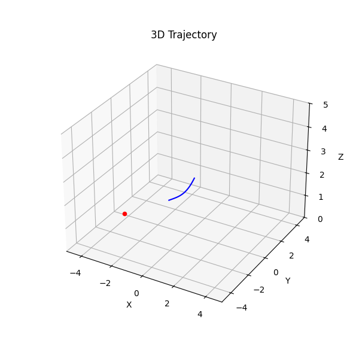
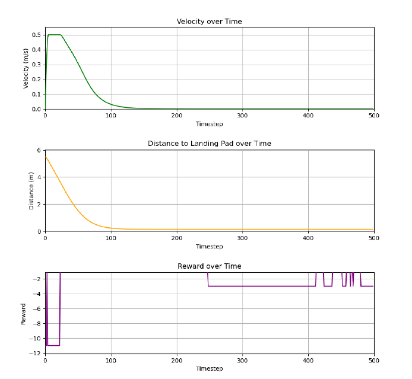

# UAV Control using Reinforcement Learning (RL)

## Introduction
This is a small example project that demonstrates how to use reinforcement learning (RL) to control an unmanned aerial vehicle (UAV). The UAV is controlled by adjusting its acceleration to reach a target destination while minimizing time and maintaining safe motion parameters such as speed and acceleration.

## Dependencies
This project mainly bases on two library: `Stable-Baselines3` and `Gymnasium`.

For more information, please visit their respective repositories and documentation.
- [Stable-Baselines3](https://stable-baselines3.readthedocs.io/en/master/)
- [Gymnasium](https://gymnasium.farama.org/index.html)

## Environment
- **Agent**: Single UAV
- **State**: The UAV's position and velocity.
- **Observation**: The relative position of the UAV to its destination and the current mode of the UAV.
- **Action**: Acceleration applied to the UAV.

### Reward Function:
- `+100` for reaching the target.
- `-2` time penalty for each step taken.
- `+1` if the UAV moves closer to the target.
- `-1` if the UAV moves away from the target.
- `-10` if acceleration exceeds the maximum limit.
- `-10` if speed exceeds the maximum limit.

## Virtual Environment Setup
1. Install necessary packages:
   ```bash
   pip install stable_baselines3
   pip install gym==0.26.0
   pip install gymnasium==0.28.1
   pip install shimmy
   ```
2. Important Notice:

   You may need to reinstall `gymnasium==0.28.1` because the default version of gymnasium(v1.0.0) installed with stable_baselines3 does not work well with this environment.

## How to Use the Code
1. Training the Model
   ```bash
   python train.py
   ```
   Hardware setting:
   - i7-12700k
   - RTX 3060
     
   Training time:
    - About 30mins to finish 3000000 training steps.   

3. Testing and Visualization
   ```bash
   python test.py
   ```
4. You can find all the parameter settings in the `environment.py` file.
5. There is total four checkpoint or trained model. In the file you can change following code in `environment.py` to test different model.
   ```bash
   model_file = Path("ppo_simple.zip")
   ```

## Example Plots
Plot of single UAV trajectory



Plot of corresponding speed, distance and reward


